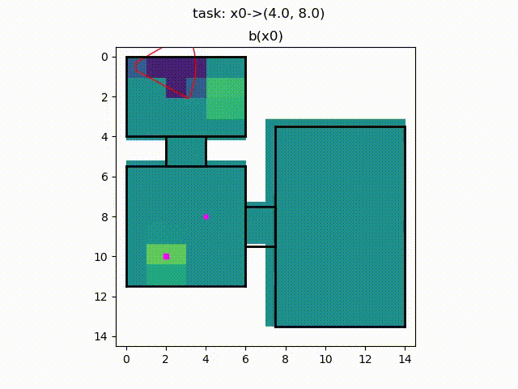

# Multi-Scale Object Search

Multi-Scale Object Search is a hierarchical POMDP framework to solve object search and delivery tasks. The method reasons on multiple spatial scales in order to reduce computation time. The problem is first solved in the top layer of the hierarchy with a coarsely discretized state space. Its solution is then refined in the lower layers with increasing resolution.

## Installation

The following instructions have been tested with Python 3. First, clone the repo.

```
git clone --recursive --branch devel git@github.com:ethz-asl/multi_scale_search.git
```

Next, we recommend to create a new virtual environment.

```
python3 -m venv --system-site-packages .venv
source .venv/bin/activate
pip install -r requirements.txt
```

The package can either be built using catkin,

```
catkin build multi_scale_search
source path/to/catkin_ws/devel/setup.zsh
```

or alternatively installed into the virtual environment using

```
pip install -e .
```

Finally, compile [SARSOP](https://github.com/AdaCompNUS/sarsop).

```
cd third_party/sarsop/src
make
```

## Running the Experiments

The following command will open a GUI that allows you to select and run different scenarios with different agents.

```
python scripts/run_experiment.py --gui
```

For example, selecting `scenario 01`, then clicking `set test scenario` followed by `Start Simulation` will produce the following solution:


